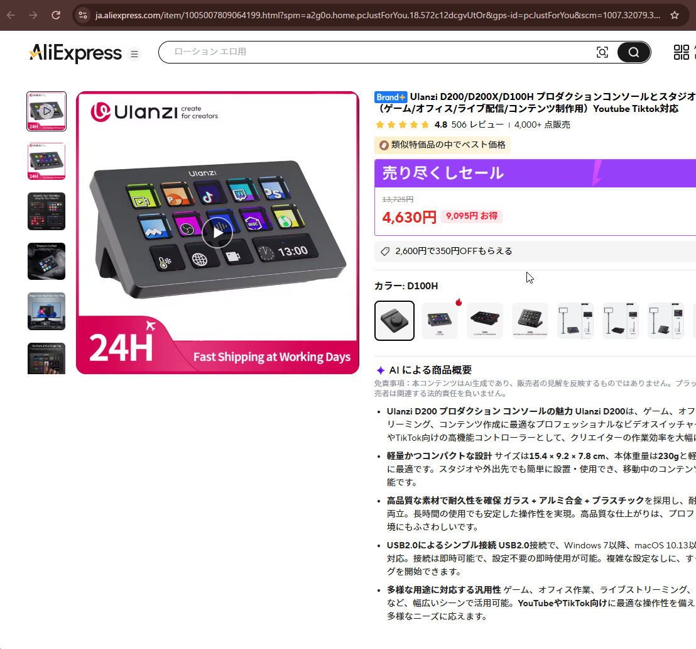
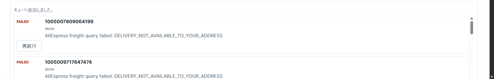
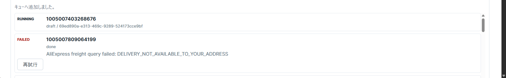
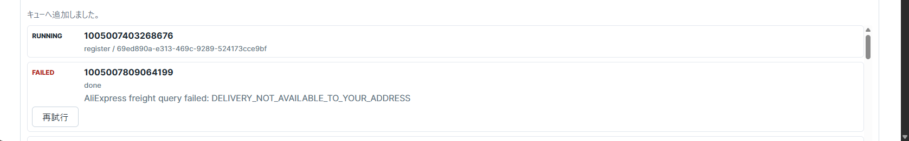
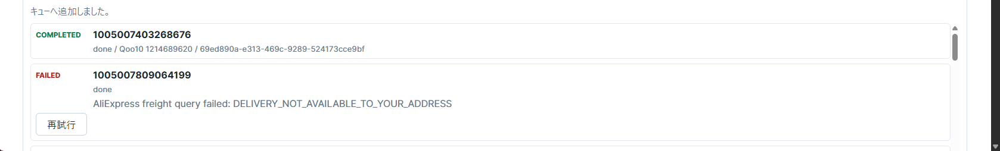
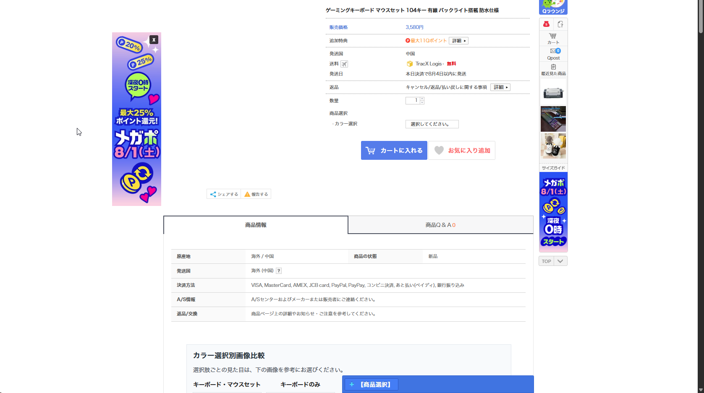
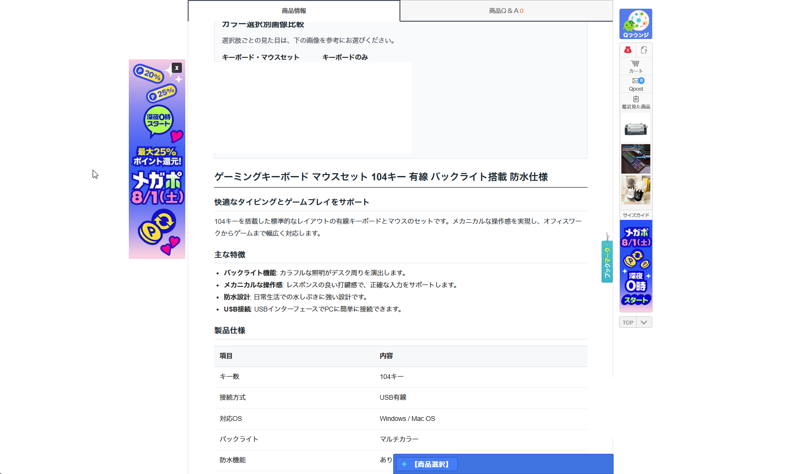

## 概要

AliExpress の商品 URL を入力するだけで、Qoo10 出品に必要な日本語商品情報ドラフトを自動生成し、商品登録および定期的な「価格・在庫同期」までを全自動化する Bun + React + LLM 製 DropShipping 出品自動化システムです。  
クラウド LLM（Gemini）とローカル LLM（Qwen3 / llama-server）の双方に対応し、API レート制限制御・自動送料計算・二重登録防止・バックグラウンドでの価格・在庫保守機能を備えています。

---

## 開発背景・課題意識

無在庫転売（DropShipping）において、手動出品および在庫・価格管理には以下の課題が存在していました：

1. **商品情報作成の膨大な手作業**: 海外（中国/英語）の仕様・画像・SKU バリエーションを日本語 EC 向けに手動で翻訳・修正・カテゴリ分類する作業負荷。
2. **複雑な着地原価計算**: 為替変動、国際送料（追跡可能最安便）、関税、Qoo10 手数料および市場価値に合わせた価格設定の難しさ。
3. **仕入れ先の価格・在庫変動による赤字・売り切れリスク**: AliExpress 側の在庫切れや急激な価格高騰をリアルタイムに Qoo10 へ反映できないリスク。

これらの課題を解消し、**1URL 入力から出品・価格最適化・在庫同期までをシームレスかつ安定して自動化する環境** を構築しました。

---

## 技術スタック & アーキテクチャ

| カテゴリ | 採用技術 |
| :--- | :--- |
| **言語 / ランタイム** | TypeScript (ESModules), Bun (HTTP Server / Script Execution) |
| **フロントエンド UI** | React, Vite, Tailwind CSS (Typeinput 風直感編集 UI, Markdown プレビュー) |
| **バックエンド / API** | Bun Native Router / REST API (`src/server`) |
| **AI / LLM 統合** | Google Gemini API (`gemini-1.5-flash`), OpenAI 互換 API (`llama-server`, `Qwen3-14B/32B-Instruct`) |
| **外部 API 連携** | AliExpress DropShipping API (`.ds.product.get`, `.ds.freight.query`), Qoo10 QAPI/OpenAPI (`SetNewGoods`) |
| **画像処理 / メディア** | `sharp` (リサイズ・フォーマット変換), `rembg` (Python 背景切抜き), Cloudflare R2 |
| **コンテナ・インフラ** | Docker, Docker Compose, Cloudflare Tunnel (`callback-catcher`, `price-maintenance` 独立コンテナ) |

---

## システム動作フロー ＆ UI ギャラリー

本システムによる AliExpress から Qoo10 への一括自動出品フローです：

### ステップ 1: 仕入れ元となる AliExpress 商品ページ
転送元となる AliExpress の商品ページ（海外向け仕様、英語/中国語のバリエーション、ドル建て価格など）。

### ステップ 2: Typeinput 風 UI への URL インプット
直感的な UI 画面から、対象となる AliExpress 商品の URL を入力し一括登録キューへ追加します。

### ステップ 3: バックエンドデータフェッチ ＆ エラーハンドリング
AliExpress DropShipping API を呼び出し、商品仕様・画像・SKU・リアルタイム送料を取得します。API 制限やエラー発生時には画面上に適切なエラーハンドリングが表示されます。

| API Fetch 実行中 | API 取得エラー時 |
| :---: | :---: |
|  |  |

### ステップ 4: LLM ドラフト自動生成 ＆ Qoo10 API 登録
Gemini 1.5 Flash または Local LLM (Qwen3) が Qoo10 カテゴリ推定・日本語タイトル最適化・下2桁80円丸め着地原価計算を行い、`SetNewGoods` API へ送信します。

| LLM ドラフト生成中 | Qoo10 API 登録中 |
| :---: | :---: |
|  |  |

### ステップ 5: 登録完了 ＆ 完成した Qoo10 出品ページ
キューが完了となり Qoo10 商品 ID が割り当てられ、実際の Qoo10 ショップ上に日本語化・価格最適化された完成ページが公開されます。

| Qoo10 出品ページ例 1 | Qoo10 出品ページ例 2 |
| :---: | :---: |
|  |  |

---

## コア技術と実装の工夫点

### 1. 二重認証モード対応の AliExpress OAuth 2.0 & レートリミット制御

AliExpress DropShipping API との安定した連携を図るため、強固な認証・トークン管理基盤を実装しています (`src/lib/aliexpress-ds-client`)：

- **二重認証モード対応 (`security` / `standard`)**:
  - `/auth/token/security/create` を用いたセキュアトークン発行および標準 OAuth 認可フローの両方に対応。
- **Cloudflare Tunnel 連携 `callback-catcher`**:
  - Docker Compose 環境にて OAuth リダイレクトコールバック受給専用の軽量ポートを待機させ、受け取った認可コードを自動的にトークンへ交換・保存。
- **トークン自動ライフサイクル管理**:
  - 10 分周期のバックグラウンドタスクで `refresh_token` の有効期限をチェックし、アクセストークンを自動更新 (`ALIEXPRESS_AUTO_REFRESH_ENABLED`)。
- **直列化 ＆ 指数バックオフ制御**:
  - API 呼び出し制限 (HTTP 429 / `ApiCallLimit`) 回避のため、全 API リクエストをアプリ内で直列制御し、最小リクエスト間隔 (`ALIEXPRESS_API_MIN_INTERVAL_MS`) の保持および指数バックオフを自動適用。

### 2. LLM による日本語最適化・Qoo10 カテゴリ自動選定・プロンプト抽象化

AliExpress の英語/中国語データを日本の Qoo10 向け高品質ドラフトへ変換するインテリジェント処理基盤を構築しています (`src/lib/gemini`, `src/lib/qoo10`)：

- **500,000 件以上の Qoo10 カテゴリツリー連携**:
  - 大容量の `qoo10_categories.json` から、商品の属性・タイトルに最適な Qoo10 カテゴリ ID を LLM が推論・分類。
- **構造化 JSON 生成 ＆ Markdown HTML 変換**:
  - タイトル・商品説明・検索キーワード・SKU バリエーション名を自然な日本語に翻訳・構造化し、商品説明を Qoo10 仕様の HTML へ自動コンバート。
- **LLM プロバイダー切り替え層**:
  - クラウド型（Gemini API）とローカル型（`llama-server` 経由の Qwen3）を `.env` またはリクエストごとにコンテナ再起動なしで動的切替可能。

### 3. 着地原価計算エンジン ＆ Qoo10 端数丸めアルゴリズム

正確な利益確保と販売戦略に合わせた自動価格設定アルゴリズムを導入しています：

- **リアルタイム最安送料試算**:
  - `aliexpress.ds.freight.query` API を呼び出し、追跡可能な最安配送方式の送料を取得して商品価格に加算（着地原価の算出）。
- **価格帯別マージン設定**:
  - 仕入れ原価に応じて最適な利益率を自動適用（例: 500円以下は2.5倍、2000円以下は1.7倍、4000円超は1.3倍など）。
- **「下二桁 80 円」丸め処理**:
  - 日本の EC 市場で購買率の高い価格表記（例: 1,980 円、2,480 円、3,980 円）へ自動で丸め計算。

### 4. バックグラウンド自動価格・在庫同期ワーカー (`price-maintenance`)

仕入れ元の変動によるトラブルを未然に防ぐため、UI 非依存の自立型バックグラウンドワーカーを構築しています：

- **商品マッピング台帳管理**:
  - 登録成功時に AliExpress `ProductId` と Qoo10 商品番号の対応関係を `.data/qoo10-registration-map.json` に二重登録防止チェック付きで永続化。
- **無人全自動巡回・同期**:
  - HTTP サーバーを起動しない専用コンテナ (`docker compose --profile maintenance up -d price-maintenance`) が、12〜24時間ごとに Qoo10 の商品一覧を照合し、価格・在庫差分を自動更新。

---

## インフラ & Docker 運用

- **マルチコンテナ構成 (Docker Compose)**:
  - アプリ本体 (`app`)、認可受給 (`callback-catcher`)、自動保守 (`price-maintenance`) を分離してコンテナ定義。
- **Windows ネイティブ LLM / 背景切抜き連携**:
  - 重い Python 依存（`rembg`）や画像処理（`sharp`）は Docker コンテナ内で完結させつつ、高速な GPU 推論（`llama-server`）は Windows ホスト側で実行し `host.docker.internal` 経由で通信。
- **永続化データマウント**:
  - `.data` ディレクトリをホストへマウントし、認証トークン・登録台帳・同期設定をコンテナ再作成時も完全に保持。

---

## 現在の運用状況 ＆ 今後の開発計画

### 現在の運用状況
自身の Qoo10 店舗運用および DropShipping 自動化プラットフォームとして稼働中です。手動での商品登録作業を大幅に削減し、価格・在庫の自動保守によって低リスクかつ高効率な EC 運用を実現しています。

### 今後の開発計画：データサイエンスを活用した「動的価格最適化（Dynamic Pricing）」への進化
現在の価格設定ロジックは、「仕入れ原価＋最安送料」に価格帯別の固定倍率を掛け合わせるルールベース（一律の静的アルゴリズム）で運用しています。しかし、利益率と売上の双方を最大化するためには、より**データサイエンスに基づいたインテリジェントな動的価格戦略**が必要であると考えており、以下の拡張構想を設計しています：

1. **競合・市場価格の機械学習分析（Price Elasticity Modeling）**:
   - Qoo10 内の同類商品や競合店舗の販売価格・ポイント還元率・閲覧傾向データを収集・蓄積。
   - 価格弾力性（Price Elasticity of Demand）モデルを導入し、需要の変動に応じた最適価格帯の推定。
2. **需要予測 ＆ 機械学習によるリアルタイムダイナミックプライシング**:
   - 季節要因、トレンド（SNS話題度）、在庫回転率などの特徴量を統合し、利益額（Margin）と成約率（Conversion Rate）の期待値を最大化する機械学習モデルの組み込み。
3. **プロモーション ＆ タイムセール自動最適化**:
   - Qoo10 特有のメガ割・タイムセールイベントに合わせ、利益を確保しつつアルゴリズム上で最上位表示を獲得できる動的ディスカウント戦略の全自動化。

単なる「作業の自動化ツール」にとどまらず、**データ駆動（Data-Driven）で売上と粗利を科学的に最大化する EC 運用プラットフォーム** への進化を目指しています。
