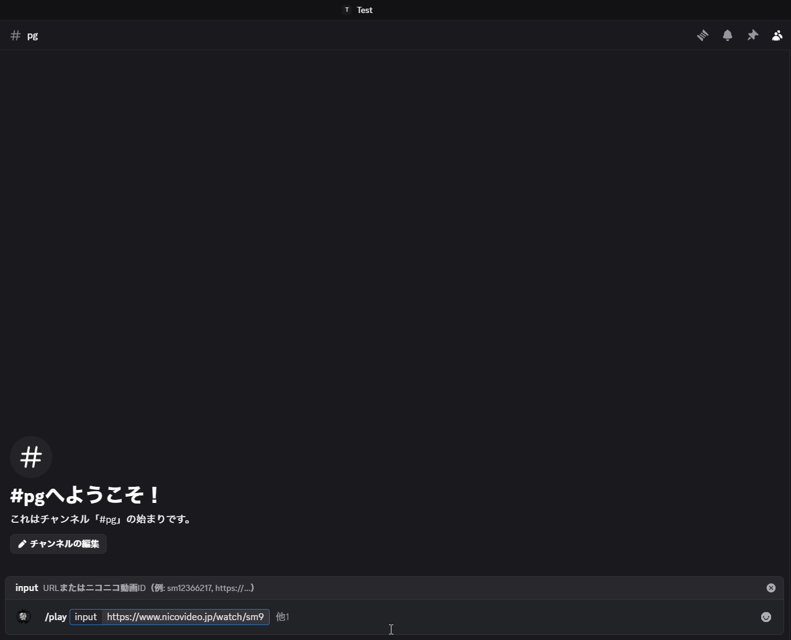
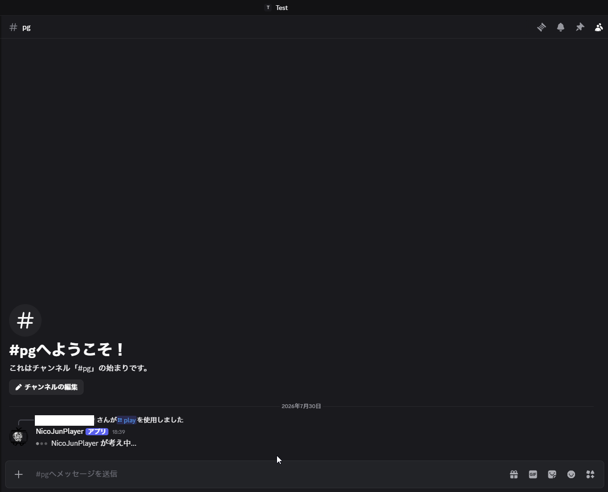
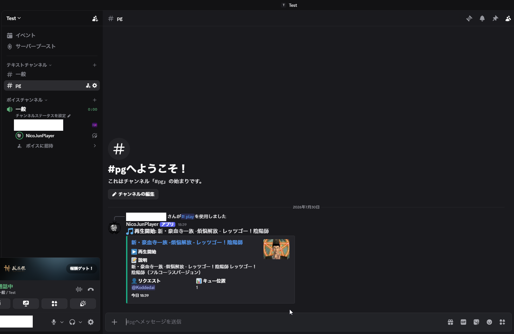
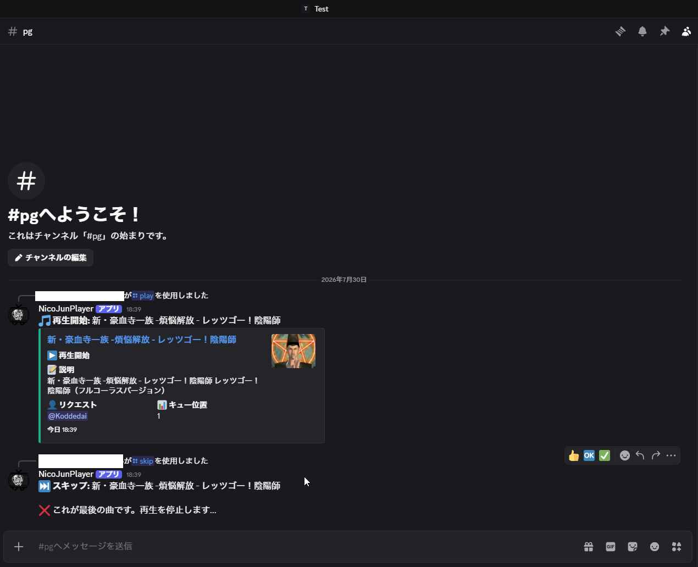

## 概要

ニコニコ動画の動画・音声コンテンツを Discord のボイスチャンネルでリアルタイム再生・共有するための高機能 Discord Bot です。  
ニコニコ動画の新配信システム（Domand / HLS）への完全対応に加え、既存の音楽 Bot では再生が困難だった「会員限定・ログイン必須動画」の再生やセッション自動更新、障害時の Discord 通知機能を備え、実運用を続けています。

---

## 開発背景・課題意識

Discord 上で友人コミュニティとニコニコ動画のコンテンツを楽しむ際、一般的な音楽 Bot では以下の課題がありました：

1. **ログイン必須動画・会員限定コンテンツの再生不可**: 認証セッションがないリクエストは拒否される。
2. **仕様変更（Domand移行）への追従不足**: 従来の HTTP 直リンクや旧 DMC 配信仕様が廃止され、HLS 暗号化/セッション制御への対応が必要。
3. **Cookie 期限切れによる運用中断**: 手動で Cookie を取得し直す手間が発生する。

これらの課題を解決し、**Discord 内でシームレスかつ安定してニコニコ動画を同時視聴できる体験** を実現するために開発しました。

---

## 技術スタック & アーキテクチャ

| カテゴリ | 採用技術 |
| :--- | :--- |
| **言語 / ランタイム** | TypeScript (ESModules), Bun 1.3 |
| **Discord API** | `discord.js` v14 (Slash Commands, Gateway Intents) |
| **音声処理** | `@discordjs/voice`, `ffmpeg` (リアルタイム WebM/Opus トランスコーディング) |
| **音声コーデック / 暗号化** | `@discordjs/opus`, `libsodium-wrappers`, `opusscript` |
| **ブラウザ自動化 / 認証** | `puppeteer` v21, Custom Cookie Manager (Netscape format) |
| **コンテナ・インフラ** | Docker, Docker Compose (UDP ポートレンジ制御: 50000-50100) |

---

## 実際の動作フロー（UI ＆ インタラクション）

### 1. スラッシュコマンドの入力 (`/play`)
Discord のテキストチャンネルで `/play` コマンドとニコニコ動画の URL または動画 ID を入力します。



### 2. バックグラウンドでのデータ処理・ストリーム準備 (`Thinking...`)
Bot がリクエストを受け取り、視聴ページメタデータ解析、最高音質/最低画質ストリーム選択、HLS API トークン取得をバックグラウンドで即座に開始します。



### 3. ボイスチャンネルでのリアルタイム再生 ＆ Rich Embed 表示
HLS プレイリストから FFmpeg 経由で WebM/Opus へトランスコーディングし、ボイスチャンネルへ音声ストリーミングを開始。チャット画面には動画タイトル・サムネイル付きの Embed カードが表示されます。



### 4. 再生コントロール（スキップ・キュー制御）
`/skip` などのコマンドにより、現在の再生を安全に終了し、キュー内の次の曲へとシームレスに切り替えます。



---

## コア技術と実装の工夫点

### 1. ニコニコ動画 (Domand / HLS) 配信システムの解析とリアルタイム変換

ニコニコ動画の最新配信システムである **Domand 形式** に対応するため、以下の内部処理ロジックを TypeScript / Node.js ストリームとして独自実装しています (`NicoNicoProvider.ts`)：

#### (A) HTML メタ解析と JSON トラック抽出
視聴ページ HTML 内の `<meta name="server-response">` からエンコードされた JSON をデコードし、`watchTrackId` および `accessRightKey` を抽出。利用可能なメディアアレイからストリームを解析します：

```typescript
// 1) 音声ストリーム: 利用可能なものから最高ビットレート (bps) を動的選択
const availableAudios = audios.filter((audio: any) => audio.isAvailable === true);
const bestAudio = availableAudios.sort((a: any, b: any) => b.bitRate - a.bitRate)[0];

// 2) 映像ストリーム: 音声要求に必要なため、最も低画質なトラックを選択し帯域を節約
const availableVideos = videos.filter((video: any) => video.isAvailable === true);
const lowestVideo = availableVideos.sort((a: any, b: any) => a.qualityLevel - b.qualityLevel)[0];
```

#### (B) HLS API セッションリクエスト
抽出した ID とアクセスキーを用いて、ニコニコ公式 API (`https://nvapi.nicovideo.jp/v1/watch/${videoId}/access-rights/hls?actionTrackId=${watchTrackId}`) へ POST リクエストを発行し、HLS プレイリスト URL (`contentUrl`) と動的セッション Cookie を取得：

```typescript
const response = await fetch(endpoint, {
    method: 'POST',
    headers: {
        'Content-Type': 'application/json',
        'X-Access-Right-Key': accessRightKey,
        'X-Frontend-Id': '6',
        'Cookie': sessionCookies
    },
    body: JSON.stringify({ outputs: [[lowestVideo.id, bestAudio.id]] })
});
```

#### (C) FFmpeg トランスコーディング ＆ `PassThrough` パイプ
取得した `contentUrl` と Cookie を FFmpeg の標準入力・ヘッダーに動的注入し、HLS から WebM / Opus 形式へリアルタイム変換して `@discordjs/voice` に供給します：

```typescript
const ffmpegArgs = [
    '-loglevel', 'warning',
    '-reconnect', '1', '-reconnect_streamed', '1', '-reconnect_delay_max', '30',
    '-headers', `Cookie: ${combinedCookies}`,
    '-user_agent', 'Mozilla/5.0 ...',
    '-i', contentUrl,
    '-vn', '-f', 'webm', '-acodec', 'libopus', '-b:a', '128000',
    'pipe:1'
];
const ffmpegProcess = spawn('ffmpeg', ffmpegArgs, { stdio: ['ignore', 'pipe', 'pipe'] });
ffmpegProcess.stdout.pipe(stream); // PassThrough ストリームへパイプ
```

### 2. 自動ログイン & Cookie 自動更新・障害通知メカニズム

ログイン必須動画の再生と長期間の無人運用を両立するため、自動セッション維持機構を構築しています：

- **Netscape Cookie フォーマット管理 (`CookieManager.ts`)**:
  - ドメイン単位での Cookie 保存・適用ロジックを自作し、安全な HTTP リクエストヘッダー生成を実現。
- **定期有効期限監視 & 自動再ログイン (`CookieRefreshManager.ts` / `CookieAuthHelper.ts`)**:
  - `NicoSessionChecker` により定期的にセッション状態を確認し、Cookie の有効期限切れ（残り3日未満）や無効化を検知。
  - ニコニコ認証 API または `Puppeteer` ヘッドレスブラウザにより自動でバックグラウンドログインを実行し、新しい `user_session` Cookie を取得・保存。
- **Discord 障害通知システム (`CookieErrorNotifier.ts`)**:
  - 万が一自動更新に失敗した場合、Discord のログ用チャンネル（`#bot-logs` 等）へ自動で警告メッセージを送信し、管理者へ即座に通知。

### 3. オブジェクト指向なマルチソース・プレイヤー設計

将来的な機能拡張を見越し、プロバイダーパターンを採用した堅牢なディレクトリ構造をとっています：

- **`AudioProvider` 抽象クラス**: `NicoNicoProvider` のほか、直接 URL 再生 (`UrlProvider`) やローカルファイル再生 (`FileProvider`) を統一インタフェースで操作。
- **`PlayerService` / `QueueManager` / `ConnectionManager`**: サーバー（Guild）ごとの接続状態管理、再生キュー（Next / Previous / Skip / AutoPlay）、エラー時の安全なリソース破棄（Stop / Clean-up）を分離・カプセル化。

---

## インフラ & Docker 運用

- **Bun ベースの軽量 Docker コンテナ**:
  - `oven/bun:1.3.0` をベースイメージに採用。ビルドツール、FFmpeg、libsodium、Puppeteer 実行用 Linux ライブラリを最適化してインストール。
- **Discord 音声用 UDP ポートマッピング**:
  - `docker-compose.yml` にて Discord voice 通信用 UDP ポート (`50000-50100:50000-50100/udp`) を適切に開放し、コンテナ環境での低遅延音声伝送を実現。
- **`restart: unless-stopped`** による常時稼働設計。

---

## 現在の運用状況 ＆ 今後の開発計画

### 現在の運用状況
自身の Discord サーバーで常時稼働中であり、友人コミュニティ内での日常的な動画・音楽共有ツールとして活用されています。単なるプロトタイプにとどまらず、API 仕様変更やエラー時のセッション復旧など、実運用における保守性・可用性を考慮した本格的なプロダクトとして運用しています。

### 今後の開発計画：ハンズフリーな「AI 音声アシスタント（Voice Control）」機能の実装
現行の仕様では、テキストチャットへのスラッシュコマンド（`/play` や `/skip` 等）による操作を前提としています。しかし、フルスクリーンゲームのプレイ中やボイスチャットでのマルチプレイ会話中には、キーボード入力そのものがユーザー体験（UX）の大きな摩擦（Friction）となります。この課題を解消するため、以下の**AI 音声アシスタント機能** の搭載を計画しています：

1. **ボイスチャット内でのリアルタイム音声認識 ＆ 音声コマンド処理**:
   - ボイスチャンネル内のユーザー発話をリアルタイムで取得し、ウェイクワード検知および意図抽出（Intent Extraction）を実施。
   - ゲームプレイを一切中断することなく、「次の曲にスキップして」「音量を少し下げて」といった自然言語でのハンズフリー操作を実現。
2. **Gemini API / LLM を活用した柔軟なセマンティック検索 ＆ レコメンド**:
   - 単なるキーワード一致ではなく、Gemini API などのマルチモーダル LLM と連携。
   - 「最近話題のボカロ曲をかけて」「90年代の懐かしいアニソンを流して」「テンションが上がる作業用BGMを探して」といった曖昧・定性的な音声指示から、適切なニコニコ動画コンテンツを柔軟に検索・再生キューへ自動追加。
3. **コンテキスト理解型ボイスインタラクション**:
   - 現在再生中の楽曲情報やチャンネル内の会話文脈（Context）を理解し、Bot が音声で対話的にレスポンスを返す高度なユーザー体験を提供。

従来の「コマンド入力型 Bot」から、**ゲーミング体験を妨げない自然な「AI 音声パートナー」** への深化を推進していきます。